<h1 align="center">🦎 Andres Zelaya Droguett</h1>

  <b>Full Stack Developer</b> &bull; <b>Software Engineer</b>

  
  
  

---

### 👋 About Me

\- 🌍 Based in **Chile**  
\- 🎓 Computer Engineering graduate, [University of Santiago](https://www.usach.cl)  
\- 🚀 Full Stack Developer at **Xintec** — backend & cloud for Cargoability (Java 21 / Spring Boot / Google Cloud)  
\- 🔌 Backend Developer (part-time) at **Austral Digital Solutions** — REST integrations with Spring Boot  
\- 🎓 Thesis: static analyzer for Spring Boot monoliths ([architecture-evaluator](https://github.com/Opsord/architecture-evaluator))  
\- 🤝 Open to collaboration  
\- 🎮 Gamer in my free time

---

### 💼 Featured Projects

| Project | Role | Stack |
|---|---|---|
| [Cargoability](https://opsord.github.io/azelaya-portfolio/#projects) — B2B freight-forwarding SaaS: quoting, shipment tracking, docs | Backend & cloud | Java 21, Spring Boot, PostgreSQL, Google Cloud, Stripe |
| [Architecture Evaluator](https://github.com/Opsord/architecture-evaluator) — thesis: static analyzer flagging architectural smells in Spring monoliths | Author | Java, JavaParser |
| [RosenmannLópez platform](https://opsord.github.io/azelaya-portfolio/) — project docs, tasks & Drive permissions for an architecture studio | PM/PO · CI/CD & quality | GitHub Actions, Docker, SonarCloud, Nginx |

---

### ⚒️ Tech Stack

 

---

### 📈 GitHub Stats

 

 

---

<picture>
  <source media="(prefers-color-scheme: dark)" srcset="https://raw.githubusercontent.com/Opsord/Opsord/output/github-snake-dark.svg" />
  <source media="(prefers-color-scheme: light)" srcset="https://raw.githubusercontent.com/Opsord/Opsord/output/github-snake.svg" />
  
</picture>
